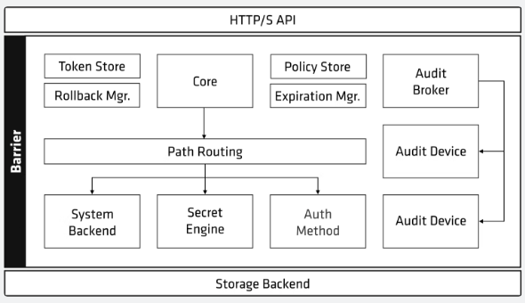

# Vault

https://kodekloud.com/courses/lab-hashicorp-certified-vault-associate-certification/

https://github.com/btkrausen/hashicorp

* Usernames and passwords
* Certificates
* API Keys
* Encryption Keys

#### Vault Interfaces
* CLI
* UI
* API Keys

#### Benefits
* Store long-lived, static secrets
* Dynamically generate secrets, upon request
* Fully-Featured API
* Identity-based access across different clouds and systems
* Provide Encryption as a Service
* Act as a Root or Intermedite Authority
* Vault has a default TTL of 768 hours (32 days) and this can be changed in the Vault configuration file. 

#### Versions
* Open Source
* Enterprise
* HCP


### Installation
1. Install Vault
2. Create Configuration FIle
3. Initialize Vaulut
4. Unseal Vault

```
wget -O- https://apt.releases.hashicorp.com/gpg | sudo gpg --dearmor -o /usr/share/keyrings/hashicorp-archive-keyring.gpg
echo "deb [signed-by=/usr/share/keyrings/hashicorp-archive-keyring.gpg] https://apt.releases.hashicorp.com $(lsb_release -cs) main" | sudo tee /etc/apt/sources.list.d/hashicorp.list
sudo apt update && sudo apt install vault
```

Running Vault Dev Server
* Run without configuration
* Automatically initialized and unsealed
* Enables UI: 127.0.0.1:8200
* Provides an Unseal key
* Automatically logs in as root
* Non-Persistent - Runs in memory
* Insecure -> doesn't use TLS
* ounts a K/V v2 Secret Engine
* Provides a root key

```
  # vault server -dev
```

# Vault Components
1. Storage Backends
    * Configures location for storage of Vault data
    * Storage is defined in the main Vault configuration file with desired parameters.
    * All data is encrypted in transit (TLS) and at-rest using AES256
    * Not all storage backends are created equal:
      * Some support HA
      * Others have better tools for management & data protection.
    * There is only one storage backend per Vault Cluster!
  
2. Secret Engines
    * Vault components that are responsible for **managing secrets** for your organization.
    * Secrets Engines can store, generate, or encrypt data
    * Many Secret Engines connect to other services to generate dynamic credentials on-demand
    * Many secrets engines can be enabled and used as needed
      * Even multiple screts engines of the same type
    * Secret engines are enabled and isolated at a "path"
      * All interactions are done directly with the "path" itself.
  
3. Authentication Methods
   * Vault components that perform **authentication** and manage **identities**
   * Responsible for assigning identity and policies to a user
   * Multiple authentication methods can be enabled depending on your use case
     * Auth methods can be differentiated by ***human vs. system*** methods
   * Once authenticated, Vault will issue a client token used to make all subsequent Vault requests (read/write)
     * The fundamental goal of all auth methods is to obtain a token
     * Each token has an associated policy (or policies) and a TTL
   * Default authentication method for a new Vault deployment = *tokens*
   * Tokens are the core method for authentication within Vault
     * Most operations in Vault require an existing token
   * The token auth method is responsible for creating and storing tokens
     * Token auth method cannot be disabled
     * Authenticating with external identity (LDAP, OIDC) will generate a token
   * If no tkent is supplied for non-authentication requests, there are not redirects for authentication - no hints or suggestions - and throws a 403 Access denied error.
   * Most auth methods must be enabled before you can use them
   * One or many auth methods can be used at any given time. 
   * Only method of authentication for a new Vault deployment is a **root** token
   * Each auth method is enabled at a path
     * A path name can be choosen when you enable the auth method
     * If a name is not provided, the auth method will be enabled at its default path
     * The default path name is equal to the type of the auth method (example, aws is mounted at **aws**, approle is mounted at **approle**)

4. Audit devices
   * Keeps detaild log of all **requests** and **responses** to Vault
   * Audit log is formatted using JSON
   * Sensitive information is hashed (HMAC-SHA256) before logging
   * Can (and should) have more than one audit device enabled
   * If vault cannot write to a persistent log, it will stop responding to client requests - which means Vault is down!
   * Vault requires at least one audit device to write the log before completing the Vault request - if enabled
     * Prioritizes safety over availability
   * Audit Device:
     * File: 
       * Writes to a file - appends logs to the file
       * does not assist with log rotation
       * use **fluentd** or similar tool to send to collector
     * Syslog:
       * writes audit logs to a syslog
       * sends to a local agent only
     * Socket:
       * writes to a tcp, udp or unix socket
       * unreliable 
       * should be used where strong guarantees are not required 

# Vault Architecture



## Vault Paths
* Everything in Vault is path-based
* The path **prefix** tells Vault which component a request should be routed
* Secret Engines, auth methods, and audit devices are "mounted" at a specified path
  * Often referred to as a "mount"
* Paths available are dependent on the features enabled in Vault, such as Auth Methods and Secrets Engines
* System backend is a default backend in Vault which is mounted at the /sys endpoint
* Vault components can be enabled at ANY path you'd like using the **-path** flag
  * Each component does have a default path you can use as well
* Vault has a few System Reserved Path which you cannot use or remove:

| Path Mount Point | Descriptio |
|---|---|
|**auth/**| Endpoint for auth method configuration|
|**cubbyhole**| Endpoint used by the Cubbyhole secrets engine|
|**identity/**| Endpoint for configuring vault identity (entities and groups)|
|**secret/**| Endpint used by Key/Value v2 secrets if running in dev mode|
|**sys/**| System endpoint for configuring Vault|

### Vault data protection  
**Master Key** - used to decrypt the encryption key
    * Created duing the vault initialization or during a rekey operation
    * Never written to storage when using traditional unseal mechanism
    * Written to core/master (storage backend) when using Auot Unseal  

**Encryption Key** - used to encrypt/decrypt data wirtten to storage backend
    * Encrypted by the Master Key
    * Stored alongside the data in a keyring on the storage backend
    * Can be easily rotated (manual operations): When rotated, old and new keys will be stored. Existing data will be handled by using the old data, and new data will be handled by new key.

### Seal and Unseal
    * Vault starts in a selaed state, meaning it knows where to access the data, and how, but can't decrypt it
    * Almost no operations are possible when Vault is in a sealed state (only status check and unsealing are possible)
    * Unsealing Vault means that a node can reconstruct the master key in order to decrypt the encrypt key, and ultimately and read the data.
    * After unsealing, the encryption key is stored in memory
    * Sealing Vault means Vault **throws away** the encryption key and requires another unseal to perform any further operations
    * Vault will start in a sealed state - you can also manually seal it via UI, CLI, or API
    * When to seal Vault?
      * Key shards are inadvertently exposed
      * Detection of a compromise or network intrusion
      * Sypeware/malware on the Vault nodes

#### Seal and Unseal - Options
  * **Key Sharding (Shamir)**
      * Default option for unsealing - no configuration needed
      * Five keys will be generated
      * Atleast three keys are required to unseal
      * No single persion shoud have access to all key shards
      * Ideally, each key shard should be sotred by a different employee
      * When initializing Vault, you can request the individual shards to be encrypted with different PGP keys: In this case the initialization process takes public keys (PGP) from different people and generates the keys
      * When unsealing Vault, you will need an equal number of employees to provide their key which is equal to the threshold
      * Key shards should not be stored online and should be highly protected - ideally stored encrypted.
  
  * Cloud Auto Unseal
    * Auto Unseal uses a cloud or on-premises HSM to decrypt the Master key
    * Vault configuration file identifies the particular key to use for decryption
    * Cloud Auto Unseal automatically unseals Vault upon service or node restart without additional intervention
    * Available in both open source and Enterprise editions
    * Formally an Enterprise-only feauture until Vault 1.0
  
  * Transit Auto Unseal
    * Uses the Transit Secret Engine of a different Vault cluster
    * The Transi Secret Engine may be configured in a Namespace
    * The Transit Unseal supports key rotation
    * Available in open source and Enterprise
    * The core Vault cluster must be HA

### Vault initialization
* Initializing Vault prepares the backend storage to receive data
* Only need to intialize a vault cluster  one time via a single node
* Vault initialization is when Vault creates the master key and key shares
* Options to define thresholds, key shares, recovery keys, and encryption
* Vault initialization is also where the initial root token is generated and returned to the user
* Vualt can be initialized via CLI, API, or UI
  
  ```
  sudo vi /etc/systemd/system/vault.service

    [Unit]
    Description=vault service
    Requires=network-online.target
    After=network-online.target
    ConditionFileNotEmpty=/etc/vault/config.json

    [Service]
    EnvironmentFile=-/etc/sysconfig/vault
    Environment=GOMAXPROCS=2
    Restart=on-failure
    ExecStart=/usr/bin/vault server -config=/etc/vault/config.json
    StandardOutput=/logs/vault/output.log
    StandardError=/logs/vault/error.log
    LimitMEMLOCK=infinity
    ExecReload=/bin/kill -HUP $MAINPID
    KillSignal=SIGTERM

    [Install]
    WantedBy=multi-user.target

  ```

  ```
  $ sudo systemctl start vault.service
  $ sudo systemctl enable vault.service

  $ export VAULT_ADDR=http://192.168.1.120:820 
  $ echo "export VAULT_ADDR=192.168.1.120:8200" >> ~/.bashrc

  As root:
  # vault operator init > /etc/vault/init.file

  ```

### Vault configuratio file
* Vault servers are configured using a file
  * Written in HCL or JSON
* The configuration file includes different stanzas and parameters to define a variety of configuration options
* Configuration file is specified when starting Vault using the **-config** flag
* Usually stored somewhare in /etc (doesn't have to be), can be speficied by **-config** flag

The configuration file contains:
1. Storage Backend
2. Listener(s) and Port
3. TLS certificate 
4. Seal Type
5. Cluster Name
6. Log Level
7. UI
8. Cluster IP and Port

## Authentication Workflow
1. User or application: Authenticate with Credentials
2. Vault: Validate credentials agains provider
3. Vault: Generate a Vault token with policy and TTL
4. Vault: Return token to the User or Application
5. User or Application: uses token for subsequent requests and the token is expired.

## Configuring Auth methods (CLI)

```
    Command: vault auth <command>

    <command> can be enable, disable, list, tune or help

    Example:
    $ vault auth enable -path=apps -description=MyApps approle

    After the auth method has been enabled, use the auth prefix to configure the auth method:

    $ vault write auth/approle/role/vault-course secret_id_ttl=10m token_num_uses=10 token_ttl=20m

```

## Vault Entities
* Vault creates an entity and attaches an alias to it if a corresponding entity doesn't already exists. This is done using the identity secrets engine, which manages internal identities that are recognized by Vault
* An entity is a representation of a single person or system used to log into Vault. Each entity is made up of zero or more aliases.
* Alias is a combination of the auth method plus some identification. It is a mapping between an entity and auth method(s). These will be useful when an object has multiple access privileges to different end points.
  

## Vault Groups
* A group can contain multiple entities 
* A group can have subgroups
* Policies can eb set on the group
* Two types of groups:
  * Internal Group: Created in Vault
  * External Group: Vault infers and creates based on group associations coming from auth methods.

A token is tied to a policy. Auth method provides authentication and policy handles the authorization.

## Vault polices
* Polices are **Deny by Default** (implicit deny)
* Polices are attached toa token. A token can have mutiple policies. Policies are cumulative and capabilities are additive. 
* **root** policy is created by default - superuser with all permissions
  * This cannot changed nor delete
  * Attached to all root tokens
* **default** policy is created by default
  * This policy can be changed but cannot be deleted
  * Attached to all non-root tokens by default, but this can be removed
* Policies **grant** or **forbid** access to those paths and operations.
* Administrative policies (some):
  * Licensing
  * Setup New Vault Cluster
  * COnfigure UI
  * Rotate Keys
  * Seal Vault

```
vault policy:
    - delete
    - list
    - fmt
    - read
    - write

vault policy write <name> <file.hcl>

### Anatomy of a Vault Policy:

path "<path>" {
    capabilties = ["<list of permissions>"]
}
```

### Paths
* Root-protected paths
  * Many paths in Vault require a **root token** or sudo capability to use
  * These paths focus on important/critical paths for Vault or plugins
  * Examples:
    * auth/token/create-orphan 
    * pki/root/sign-self-issued
    * sys/rotate
    * sys/seal
    * sys/step-down
* "*" is a wild card for the path
* The plus (+) supports wildcard matching for a single directory in the path. Can be used in multiple path segments.
  * Example:
     secret/+/db: matches secret/db2/db or secret/app/db etc.
* ACL Templating:
  * Use *variable replacement* in some policy strings with vaules available to the token.
  * Define policy paths containing double curly braces: {{\<parameter>}}
    | Parameter | Description |
    | --- | --- |
    | identity.entity.id | The entity's ID|
    | identity.entity.name | The entity's name|
    | identity.entity.metadata.\<\<metadata key>>|
    
    These are some examples. 
    

### Capabilites
* Capablites are specified as a list of strings
  * create, read, update, delete, list, sudo, deny

```
Examples:
$ vault token create -policy="\<policy-name>"

```

### Vault Tokens
Token length: 95 bytes at least.

* Tokens are the core method for authentication
* The token auth method is responsible for creating and storing tokens.
* The tomen auth method cannot be disabled.
* Tokens can be used directly, or they can be used with another auth method
* Authenticating with external identity (ex. LDAP) dynamically generate tokens
* Tokens have one or more policies attached to control what the token is allowed to perform.

#### Types 
* Service tokens are the default token type in Vault
  * They are persisted to storage (heavy storage reads/writes)
  * Can be renewed, revoked, and create child tokens
  * Most often these the ones we work with.
  
* Batch tokens are encrypted binary large objects (blobs)
  * Designed to be lightweight & scalable
  * They are not persisted to storage but they are not fully-featured
  * Ideal for high-volume operations, such as encryption
  * can be used for DR replication cluster promotion as well.
  * These cannot be renewed

Tokens carry information and metadata that determines how the token can be used, what type of token, when it expires etc.
    * Accessor
    * Policies
    * TTL
    * Max TTL
    * Number of Uses Left
    * Orphaned Token
    * Renewal Status

#### Token Heirarchy
* Each token has a TTL, exception: root token has no TTL
* Tokens are revoked once reached its TTL unless renewed
* When a parent token is revoked, all of its children are revoked as well.

1. **Periodic Service Token:** Best for long running app which cannot handle the regeneration of a token or secret.
   * Root or sudo users have the ability to generate these tokens
   * Periodic tokens have a TTL, but no max TTL
   * Periodic tokens may live for an infinite amount of time, so long as they are renewed withen their TTL
2. **Service Token With Use limit:** That gets revoked automaticall after first use
   * Limit the token's number of uses in addition to TTL and Max TTL
   * Use limit tokens expire at the end of their last use, regardless of their remaining TTLs.
   * use limit tokens expire at the end of their TTls, regardless of remaining uses.  
3. **Orphan Service Token:** A token where a child should not influenced by parents life cycle.
   * Root or sudo usrs have the ability to generate orphan tokens
   * Orphan tokens are not children of their parent; therefore, do not expire when their parent does
   * Orphan tokens still expire when their own Max TTL is reached

Pass **-period** flag to vault token command or when a auth method is created, **token_type** and **period** can be passed.


#### Prefix

| Token Type | Vault 1.10 and later |
| --- | --- |
| Service tokens| hvs. |
| Batch tokens | hvb. |
| Recovery tokens | hvr. |

Command Syntax:

**vault token** command can be used for the following tasks:
* capabilities
* create
* lookup
* renew
* revoke

#### Root tokens
* Root token is a superuser that has unlimited access to Vault
* It does not have a TTL
* Attached to the root policy
* Root tokens can create other root tokens that do have a TTL.
* Once a proper auth method is established, revoke the root token
* Unseal keys can be used to create a root token - A quorom of unseal key holders can generate a new root token. 
* Initial root token comes from the Vault initialization.
* **vault operator generate-root -init** command, then the quorum has to run **vault operator generate-root** command with their keys. 

#### Token Accessors
* Every token has a token accessor that is used as a reference to the token
* Token accessors can be used to perform limited actions:
  * Look up token properties
  * Look up capabilites of a token
  * Renew the token
  * Revoke the token
* Token accessors cannot be used for authentication to Vault or to perform additional requests.

## Vault Secret Engines

**Static Secrets**
  * Expiration
  * Secrets aren't secret
  * Validity
  * Rotation
  * Long-lived

**Dynamic Secrets**
